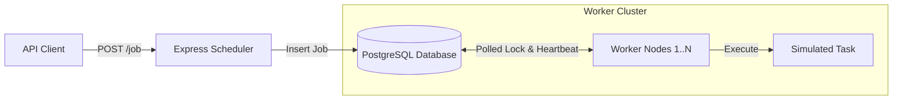
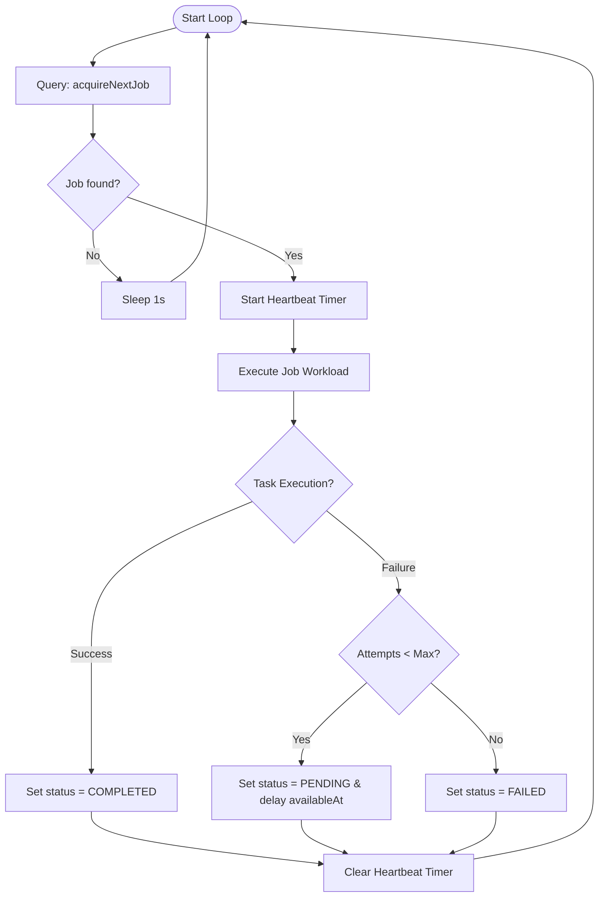

# System Architecture & API Specification

This document details the system design, transaction mechanics, worker lifecycles, and API endpoints for the Distributed Job Scheduler.

---

## Architecture Diagram

The system uses a producer-consumer model coordinated through PostgreSQL row-level locks.



---

## Database Schema Design

The `Job` table manages the state of the task queue. It is defined in [schema.prisma](packages/db/prisma/schema.prisma):

| Field | Type | Description |
| :--- | :--- | :--- |
| `id` | `String` (UUID) | Primary Key. |
| `type` | `String` | The execution script target (e.g., `send_email`, `image_processing`). |
| `payload` | `Json` | Arguments required to execute the job. |
| `status` | `Enum` | Queue state: `PENDING`, `RUNNING`, `COMPLETED`, `FAILED`. |
| `priority` | `Int` | Priority level (higher value = processed first). Defaults to `0`. |
| `lockedBy` | `String` | The UUID of the worker currently running this job. |
| `lockedAt` | `DateTime` | Timestamp of the latest pick-up or heartbeat. |
| `attempts` | `Int` | Number of times this task has been run. |
| `availableAt` | `DateTime` | Timestamp barrier. The task cannot run before this time (used for delays & retries). |

---

## Core Algorithms

### 1. Polling & Lock Acquisition
The SQL query located in `acquireNextJob` combines task fetching, priority sorting, and crash recovery in a single transaction:

```sql
WITH next_job AS (
    SELECT id
    FROM "Job"
    WHERE (status = 'PENDING' AND "availableAt" <= NOW()) -- Tasks ready to run
       OR (status = 'RUNNING' AND "lockedAt" < NOW() - INTERVAL '30 seconds') -- Recover stalled tasks
    ORDER BY "priority" DESC, "createdAt" ASC -- Priority scheduling
    LIMIT 1
    FOR UPDATE SKIP LOCKED -- Prevent workers from blocking each other
)
UPDATE "Job"
SET
    status = 'RUNNING',
    "lockedBy" = $1, -- workerId
    "lockedAt" = NOW(),
    "attempts" = attempts + 1
FROM next_job
WHERE "Job".id = next_job.id
RETURNING *;
```

`FOR UPDATE SKIP LOCKED` locks only the selected row. Other workers executing this query concurrently will skip the locked row and fetch the next available task.

### 2. Worker Lifecycle & Heartbeat Loop
Each worker runs a loop that polls the database and handles heartbeats:



---

## API Documentation

The Scheduler exposes the following endpoints under `/job`.

### 1. Create a Job
* **Endpoint**: `POST /job`
* **Content-Type**: `application/json`
* **Request Body**:
  ```json
  {
    "type": "send_email",
    "payload": {
      "to": "user@example.com",
      "body": "Welcome!"
    },
    "priority": 10,
    "availableAt": "2026-07-11T12:00:00Z"
  }
  ```
  *(Note: `priority` and `availableAt` are optional).*
* **Response (201 Created)**:
  ```json
  {
    "success": true,
    "message": "Job has been created successfully",
    "data": {
      "id": "4b63e144-8cd6-4993-8ef2-efc8f35212ab",
      "type": "send_email",
      "status": "PENDING"
    }
  }
  ```

### 2. Fetch All Jobs
* **Endpoint**: `GET /job`
* **Response (200 OK)**:
  ```json
  {
    "success": true,
    "message": "Job fetched successfully",
    "data": [
      {
        "id": "4b63e144-8cd6-4993-8ef2-efc8f35212ab",
        "type": "send_email",
        "payload": { ... },
        "status": "COMPLETED",
        "priority": 10,
        "attempts": 1,
        ...
      }
    ]
  }
  ```

### 3. Fetch Pending Queue Tasks
* **Endpoint**: `GET /job/pending`
* **Response (200 OK)**:
  ```json
  {
    "success": true,
    "message": "Job fetched successfully",
    "data": [
      {
        "id": "e29e92ad-fb78-43d9-952b-232145b20ad9",
        "type": "image_processing",
        "status": "PENDING",
        "priority": 5,
        ...
      }
    ]
  }
  ```
